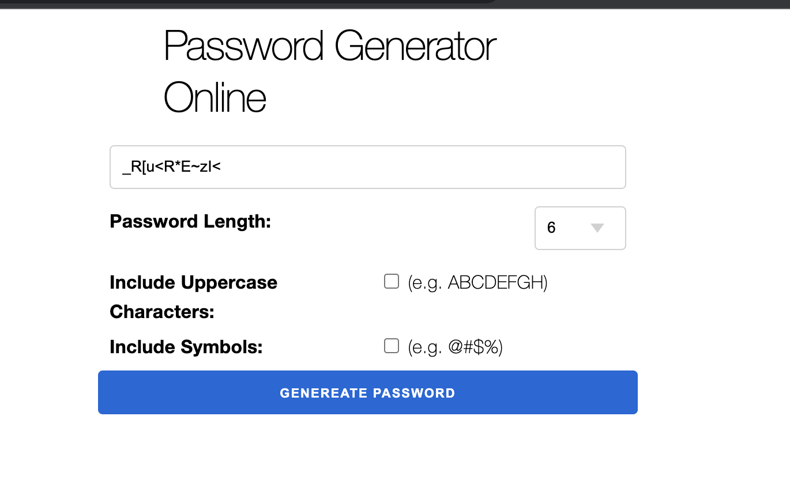

# PasswordGeneratorOnline

This is simple project password generator online 



To start your Phoenix server:

```sh
docker-compose up -d # for start postgres but this project not used !!
mix deps.get
mix ecto.create
mix phx.server # or iex -S mix phx.server
open http://localhost:4000 
```
